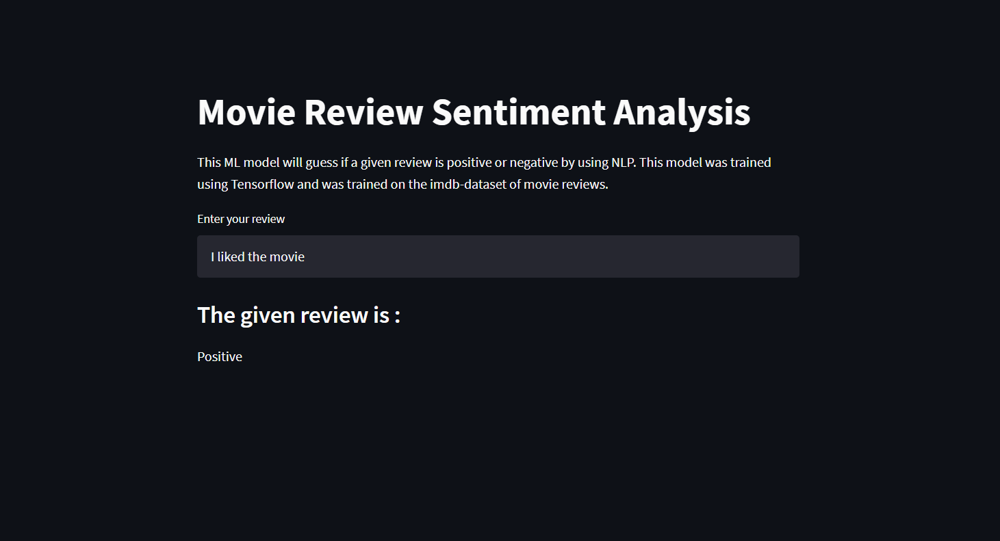

# Movie Review Sentiment Analyzer 

This ML model will guess if a given review is positive or negative by using NLP. This model was trained using Tensorflow and was trained on the imdb-dataset of movie reviews.

To try out the **Sentiment Analyzer** visit this [link](http://localhost:8501/).

---

## Table of Contents
- [Packages used](#packages-used)
- [Dataset used](#dataset-used)
- [Working of ML model](#working-of-ml-model)
- [Deploying the ML model](#deploying-the-ml-model)

---

## Packages used

- [Python](https://www.python.org/)
- [Tensorflow](https://www.tensorflow.org/)
- [Pandas](https://pandas.pydata.org/)
- [Numpy](https://numpy.org/)
- [Streamlit](https://www.streamlit.io/)

---

## Dataset Used

The dataset used is a set of imdb-reviews which is picked from [Kaggle](https://www.kaggle.com/). The dataset can be viewd from [dataset](https://www.kaggle.com/columbine/imdb-dataset-sentiment-analysis-in-csv-format).

The dataset was in CSV format.

There were 40000 reviews for **train** and 5000 reviews for **test**.

The dataset had 2 colums: -

- Text : Text for each individual review.

- Labels : Labels discribe if each review was positive or negative. **1** for positive and **0** for negative.

---

## Working of ML model

The pacakge used for training the model was [Tensorflow](https://www.tensorflow.org/).

The model was based on NLP(Natural Language Processing).

- The data was first **tokenized** using the builtin [Tokenizer](https://www.tensorflow.org/api_docs/python/tf/keras/preprocessing/text/Tokenizer) fuction of tensorflow.

- The tokenized data was then converted into **sequences** using the tokenizers [text_to_sequences](https://www.tensorflow.org/api_docs/python/tf/keras/preprocessing/text/Tokenizer#texts_to_sequences).

- The sequenced data was then **padded** using the [pad_sequence](https://www.tensorflow.org/api_docs/python/tf/keras/preprocessing/sequence/pad_sequences)

- The padded data was then fed into the ML model to train

- The model was then saved as a **HDF(Hierarchical Data Format)** file.

---

## Deploying the ML model

The model was delpoyed on the [GCP(Google Cloud Platform)](https://cloud.google.com/).

The model webpage was built using the python package [Streamlit](https://www.streamlit.io/).

